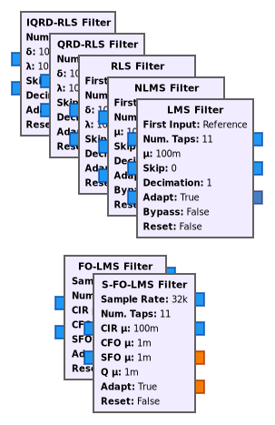

# gr-adapt

gr-adapt is a GNU Radio out-of-tree module that provides various adaptive filter blocks. 

## Overview



### Adaptive Filters

The following standard filters are provided:

* Least mean squares (__LMS__)
* Normalized least mean squares (__NLMS__)
* Recursive least squares (__RLS__)
* Recursive least squares employing QR decomposition (__QRD-RLS__ and __IQRD-RLS__)

The LMS and NLMS filters take an optional third input, which, if provided, will be used to update the filter taps. This allows the LMS and NLMS filters to be used in the filtered-x configuration (i.e. __FxLMS__ and __FxNLMS__). Furthermore, an adaptive filter is provided for estimating and tracking a channel under carrier and sampling frequency offsets:

* Frequency offsets least mean squares (__FO-LMS__)[^1]

[^1]: K. Pärlin, T. Riihonen, V. L. Nir, and M. Adrat, “Estimating and Tracking Wireless Channels under Carrier and Sampling Frequency Offsets,” IEEE Transactions on Signal Processing, vol. 71, pp. 1053&ndash;1066, Mar. 2023.

### Tests

There are several tests regarding performance and convergence of the provided filters in the [python](./python) directory. The [README](./python/README.md) in there gives an overview of those test results.

### Examples

In the [examples](./examples) directory, examples of using adaptive filter blocks are given for the following use cases:

- Adaptive line enhancer
- Self-interference cancellation
- System identification
- Time delay estimation
- Channel and frequency offsets estimation

## Installation
### Dependencies

- [GNU Radio](https://github.com/gnuradio/gnuradio) with the following components:
    - gnuradio-runtime
    - gnuradio-filter
- [VOLK](http://libvolk.org/)
- CMake 3.8
- [pybind11](https://github.com/pybind/pybind11)
- [Armadillo](http://arma.sourceforge.net/) (optional*)

\* RLS filters based on QR decomposition currently require Armadillo to work. If gr-adapt is built without Armadillo, those filters do nothing.

### Building from source

```sh
$ git clone git@github.com:karel/gr-adapt.git
$ cd gr-adapt
$ mkdir build
$ cd build
$ cmake ..
$ make -j$(nproc)
$ sudo make install
```

### Installing from AUR

A [package description](https://aur.archlinux.org/packages/gr-adapt-git/) is provided in AUR for Arch Linux users.

### Troubleshooting

If GRC complains that it can't find some modules like

```python
Traceback (most recent call last):
  File "/home/user/git/gr-adapt/examples/top_block.py", line 30, in <module>
    import adapt
  ImportError: No module named adapt
```

then most likely you used a different ```CMAKE_INSTALL_PREFIX``` for the module than for GNU Radio. Uninstall the module, then run CMake in the build directory again with the correct ```CMAKE_INSTALL_PREFIX``` and then install the module.
